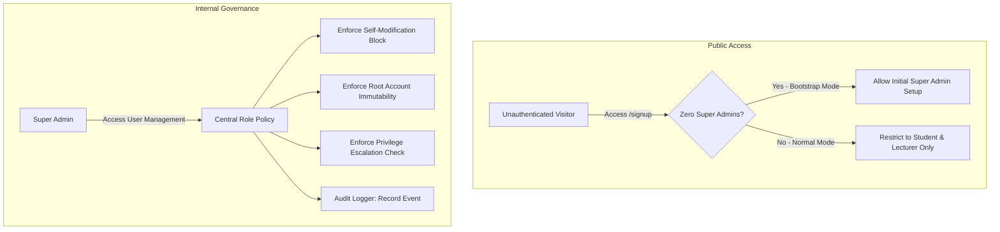

# Role Management & Security Architecture Documentation

## 1. Executive Summary

This document details the architectural enhancements implemented to secure the platform's **Role-Based Access Control (RBAC)**, eliminate privilege escalation vulnerabilities, and establish clean-code governance for user role administration and onboarding.

### Key Objectives Achieved:
1. **Root Privilege Protection**: Made the `super_admin` role immutable against accidental demotion, deletion, or self-modification.
2. **Strict Public Segregation**: Confined the public `/signup` page strictly to consumer roles (`Student` and `Lecturer`), removing public access to administrative roles.
3. **First-Run Bootstrap Invariant**: Allowed one-time root account setup during initial deployment when zero Super Administrators exist, self-locking permanently upon account creation.
4. **Audit Trail Accountability**: Automated logging via `db.createAuditLog` for all role changes and user deletions.
5. **Clean Code & DRY Centralization**: Replaced scattered ad-hoc checks with a pure, testable domain policy module (`src/pages/super-admin/user-management/utils/rolePolicy.ts`).

---

## 2. Architecture & Design Principles



---

## 3. Implemented Modules & Responsibilities

### A. Centralized Role Policy
**File:** `src/pages/super-admin/user-management/utils/rolePolicy.ts`

A pure TypeScript domain layer that decouples authorization rules from UI components.

| Function | Signature | Core Invariants Enforced |
| :--- | :--- | :--- |
| `canEditUserRole` | `(actor, targetUser) => PolicyCheckResult` | • Blocks self-role editing<br>• Blocks modifying root `super_admin` accounts |
| `canDeleteUser` | `(actor, targetUser) => PolicyCheckResult` | • Blocks self-account deletion<br>• Protects `super_admin` accounts from removal |
| `canAssignRole` | `(actor, targetUser, newRole, count) => PolicyCheckResult` | • Prohibits demoting a `super_admin`<br>• Enforces that only an existing `super_admin` can grant root status |

---

### B. User Management State & Audit Logging
**File:** `src/pages/super-admin/user-management/hooks/useUserManagement.ts`

Coordinates state, validates operations through the policy layer, and commits audit logs.

```typescript
// Role update with integrated validation and audit logging
const handleUpdateRole = useCallback(async () => {
  if (!selectedUser) return;

  const policyCheck = canAssignRole(currentUser, selectedUser, editRole, superAdminCount);
  if (!policyCheck.allowed) {
    showToast(policyCheck.reason, 'warning');
    return;
  }

  await db.updateUserRole(selectedUser.id, editRole);

  // Immutable audit record
  await db.createAuditLog(
    currentUser.id,
    'USER_ROLE_CHANGED',
    'user',
    selectedUser.id,
    {
      targetUserName: selectedUser.name,
      previousRole: selectedUser.role,
      newRole: editRole,
      modifiedBy: currentUser.email,
    }
  );
  ...
});
```

---

### C. Consistent UI Defense-in-Depth
- **`src/pages/super-admin/UserManagement.tsx`**:
  Correctly threads `currentUserId={currentUser?.id}` and `currentUser={currentUser}` across all views.
- **`StudentTable.tsx`**, **`StaffTable.tsx`**, & **`UserTable.tsx`**:
  Use `canEditUserRole` to replace actionable buttons with visual status indicators:
  - **`Protected`**: Blue badge for root Super Admin accounts.
  - **`Current User`**: Neutral badge for the logged-in session account.
- **`EditUserRoleModal.tsx`**:
  Displays security warning banners for protected accounts and disables unauthorized role selections.

---

### D. Public Signup Segregation & First-Run Bootstrap
**Files:** `src/lib/auth.ts` and `src/pages/auth/Signup.tsx`

#### 1. Backend Defense Guard (`src/lib/auth.ts`)
- Declares `PUBLIC_SIGNUP_ROLES = ['student', 'lecturer'] as const`.
- Provides `auth.isBootstrapAvailable()` which verifies if `COUNT(super_admin) === 0`.
- In `auth.signUp`:
  - Rejects attempts to register `admin` or `moderator` publicly.
  - Permits `super_admin` registration **only** when `isBootstrapAvailable()` is `true`.

#### 2. Client UX & Invariant Transition (`src/pages/auth/Signup.tsx`)
- **Standard Operation**:
  Dropdown strictly offers `Student (Learner)` and `Lecturer (Faculty)`.
- **First-Run Bootstrap Mode**:
  When zero Super Admins exist, a system notification banner appears and temporarily unlocks `★ Super Administrator (First-Run Root Setup)`. Once completed, the option is permanently locked.

---

## 4. Verification & Validation Matrix

| Test Scenario | Expected Outcome | Result |
| :--- | :--- | :--- |
| Public user registers as `Student` | Index number required; account created successfully | Passed |
| Public user registers as `Lecturer` | Email required; account created successfully | Passed |
| Public visitor attempts to register `admin` | Blocked by UI and rejected with 403-equivalent by `auth.signUp` | Passed |
| Public visitor registers `super_admin` when root exists | Rejected by `auth.signUp` with bootstrap closed error | Passed |
| First-time system launch (0 Super Admins) | Bootstrap banner active; root account creation permitted | Passed |
| Super Admin edits own account in management portal | Action disabled with `Current User` lock badge | Passed |
| Super Admin attempts to demote another `super_admin` | Action disabled with `Protected` lock badge | Passed |
| Super Admin modifies regular user role | Allowed; generates `USER_ROLE_CHANGED` audit log | Passed |
| Super Admin deletes user account | Allowed; generates `USER_DELETED` audit log | Passed |
| Production bundle compilation (`npm run build`) | Zero TypeScript or Vite bundle errors | Passed (Code 0) |
