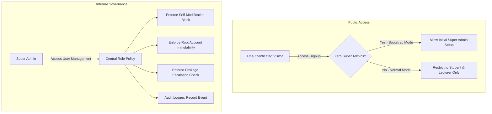
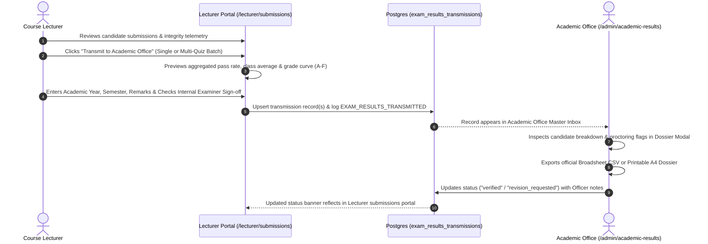

# Role Management & Security Architecture Documentation

## 1. Executive Summary

This document details the architectural enhancements implemented to secure the platform's **Role-Based Access Control (RBAC)**, eliminate privilege escalation vulnerabilities, and establish clean-code governance for user role administration and onboarding.

### Key Objectives Achieved:
1. **Root Privilege Protection**: Made the `super_admin` role immutable against accidental demotion, deletion, or self-modification.
2. **Strict Public Segregation**: Confined the public `/signup` page strictly to consumer roles (`Student` and `Lecturer`), removing public access to administrative roles.
3. **First-Run Bootstrap Invariant**: Allowed one-time root account setup during initial deployment when zero Super Administrators exist, self-locking permanently upon account creation.
4. **Audit Trail Accountability**: Automated logging via `db.createAuditLog` for all role changes and user deletions.
5. **Clean Code & DRY Centralization**: Replaced scattered ad-hoc checks with a pure, testable domain policy module (`src/pages/super-admin/user-management/utils/rolePolicy.ts`).

---

## 2. Architecture & Design Principles


```mermaid
graph TD
    subgraph Public Access
        A[Unauthenticated Visitor] -->|Access /signup| B{Zero Super Admins?}
        B -->|Yes - Bootstrap Mode| C[Allow Initial Super Admin Setup]
        B -->|No - Normal Mode| D[Restrict to Student & Lecturer Only]
    end

    subgraph Internal Governance
        E[Super Admin] -->|Access User Management| F[Central Role Policy]
        F --> G[Enforce Self-Modification Block]
        F --> H[Enforce Root Account Immutability]
        F --> I[Enforce Privilege Escalation Check]
        F --> J[Audit Logger: Record Event]
    end
```

---

## 3. Implemented Modules & Responsibilities

### A. Centralized Role Policy
**File:** `src/pages/super-admin/user-management/utils/rolePolicy.ts`

A pure TypeScript domain layer that decouples authorization rules from UI components.

| Function | Signature | Core Invariants Enforced |
| :--- | :--- | :--- |
| `canEditUserRole` | `(actor, targetUser) => PolicyCheckResult` | • Blocks self-role editing<br>• Blocks modifying root `super_admin` accounts |
| `canDeleteUser` | `(actor, targetUser) => PolicyCheckResult` | • Blocks self-account deletion<br>• Protects `super_admin` accounts from removal |
| `canAssignRole` | `(actor, targetUser, newRole, count) => PolicyCheckResult` | • Prohibits demoting a `super_admin`<br>• Enforces that only an existing `super_admin` can grant root status |

---

### B. User Management State & Audit Logging
**File:** `src/pages/super-admin/user-management/hooks/useUserManagement.ts`

Coordinates state, validates operations through the policy layer, and commits audit logs.

```typescript
// Role update with integrated validation and audit logging
const handleUpdateRole = useCallback(async () => {
  if (!selectedUser) return;

  const policyCheck = canAssignRole(currentUser, selectedUser, editRole, superAdminCount);
  if (!policyCheck.allowed) {
    showToast(policyCheck.reason, 'warning');
    return;
  }

  await db.updateUserRole(selectedUser.id, editRole);

  // Immutable audit record
  await db.createAuditLog(
    currentUser.id,
    'USER_ROLE_CHANGED',
    'user',
    selectedUser.id,
    {
      targetUserName: selectedUser.name,
      previousRole: selectedUser.role,
      newRole: editRole,
      modifiedBy: currentUser.email,
    }
  );
  ...
});
```

---

### C. Consistent UI Defense-in-Depth
- **`src/pages/super-admin/UserManagement.tsx`**:
  Correctly threads `currentUserId={currentUser?.id}` and `currentUser={currentUser}` across all views.
- **`StudentTable.tsx`**, **`StaffTable.tsx`**, & **`UserTable.tsx`**:
  Use `canEditUserRole` to replace actionable buttons with visual status indicators:
  - **`Protected`**: Blue badge for root Super Admin accounts.
  - **`Current User`**: Neutral badge for the logged-in session account.
- **`EditUserRoleModal.tsx`**:
  Displays security warning banners for protected accounts and disables unauthorized role selections.

---

### D. Public Signup Segregation & First-Run Bootstrap
**Files:** `src/lib/auth.ts` and `src/pages/auth/Signup.tsx`

#### 1. Backend Defense Guard (`src/lib/auth.ts`)
- Declares `PUBLIC_SIGNUP_ROLES = ['student', 'lecturer'] as const`.
- Provides `auth.isBootstrapAvailable()` which verifies if `COUNT(super_admin) === 0`.
- In `auth.signUp`:
  - Rejects attempts to register `admin` or `moderator` publicly.
  - Permits `super_admin` registration **only** when `isBootstrapAvailable()` is `true`.

#### 2. Client UX & Invariant Transition (`src/pages/auth/Signup.tsx`)
- **Standard Operation**:
  Dropdown strictly offers `Student (Learner)` and `Lecturer (Faculty)`.
- **First-Run Bootstrap Mode**:
  When zero Super Admins exist, a system notification banner appears and temporarily unlocks `★ Super Administrator (First-Run Root Setup)`. Once completed, the option is permanently locked.

---

## 4. Verification & Validation Matrix

| Test Scenario | Expected Outcome | Result |
| :--- | :--- | :--- |
| Public user registers as `Student` | Index number required; account created successfully | Passed |
| Public user registers as `Lecturer` | Email required; account created successfully | Passed |
| Public visitor attempts to register `admin` | Blocked by UI and rejected with 403-equivalent by `auth.signUp` | Passed |
| Public visitor registers `super_admin` when root exists | Rejected by `auth.signUp` with bootstrap closed error | Passed |
| First-time system launch (0 Super Admins) | Bootstrap banner active; root account creation permitted | Passed |
| Super Admin edits own account in management portal | Action disabled with `Current User` lock badge | Passed |
| Super Admin attempts to demote another `super_admin` | Action disabled with `Protected` lock badge | Passed |
| Super Admin modifies regular user role | Allowed; generates `USER_ROLE_CHANGED` audit log | Passed |
| Super Admin deletes user account | Allowed; generates `USER_DELETED` audit log | Passed |
| Production bundle compilation (`npm run build`) | Zero TypeScript or Vite bundle errors | Passed (Code 0) |

---

## 5. Unified Multi-Tab Executive Analytics & Reporting Suite

**Files:** `src/pages/super-admin/AnalyticsReporting.tsx` & `src/lib/database.ts`

### A. Architectural Overview
The Super Admin Analytics module provides institution-wide executive visibility across 5 primary dimensions:

1. **Command Center & Operational Throughput**
   - Live activity trends: Daily active users vs. total actions via Area spline chart.
   - Assessment volume: Started attempts compared against completed submissions via Bar chart.
   - Catalog & Role composition: Pie/Donut distributions for user community roles and quiz bank publication status.
   - High-altitude KPI cards: Total accounts, Pass Rate, Attempt volume, Proctoring flags, and At-Risk count.

2. **Academic Performance & Grade Curves**
   - Grade Tier Bell Curve: Submissions partitioned into standard academic bands (`A (80-100%)`, `B (70-79%)`, `C (60-69%)`, `D (50-59%)`, `F (<50%)`).
   - Pass vs. Fail Donut Ratio: Evaluated against institutional passing threshold ($\ge 50\%$).
   - Course-by-Course Benchmarks Table: Quiz title, subject, attempts, completion %, mean score, pass/fail counts, and score ranges.

3. **Assessment Quality & Question Item Diagnostics**
   - Item Difficulty Index: Question-level failure rates calculated across all student answers; items with $>70\%$ failure highlighted with warning badges.
   - Speed Anomaly Outliers: Detection of assessments completed in $\le 5$ minutes or abnormally fast relative to duration limits.

4. **Security, Integrity & Proctoring Intelligence**
   - Proctoring Telemetry Log: Student-level client events tracking tab switches, blocked copy/paste attempts, right-click inspections, and flagged cheating incidents.
   - Failed Authentication Audit: Real-time tracking of failed login attempts with IP addresses and denial reasons.
   - Time Extension Audit: Special accommodation request tracking with approval statuses.

5. **Student Cohort & At-Risk Trajectories**
   - At-Risk Intervention Watchlist: Automated identification of students with mean score $<50\%$ or $\ge 2$ failed assessments.
   - High-Achiever Honor Roll: Leaderboard of top-performing students with mean score $\ge 80\%$.

6. **Activity Timeline & Audit Log**
   - Daily unique active user counts and platform action frequencies with actions-per-user ratios.

### B. High-Fidelity Data Invariants & Defensive Handling
- **Date Deserialization**: Neon Serverless returns Postgres date objects that can cause React child rendering errors. All dates are safely transformed using `formatDate()`, `formatDateTime()`, or SQL `::text` casting.
- **Client-Side CSV Export**: Native `data:text/csv;charset=utf-8` download generator with sanitized cell quotes for all tables and executive briefs.

---

## 6. Academic Results Transmission & Broadsheet Review Pipeline

**Files:**
- Database & Migrations: [`src/lib/database.ts`](file:///home/chillop/project/online-quiz-app/src/lib/database.ts) (`exam_results_transmissions` table)
- Academic Export Engines: [`src/utils/academicExportUtils.ts`](file:///home/chillop/project/online-quiz-app/src/utils/academicExportUtils.ts)
- Lecturer Transmission Portal & Batch Modal: [`src/pages/lecturer/Submissions.tsx`](file:///home/chillop/project/online-quiz-app/src/pages/lecturer/Submissions.tsx) & [`src/pages/lecturer/components/TransmitResultsModal.tsx`](file:///home/chillop/project/online-quiz-app/src/pages/lecturer/components/TransmitResultsModal.tsx)
- Academic Office Review Portal & Dossier Modal: [`src/pages/admin/AcademicResults.tsx`](file:///home/chillop/project/online-quiz-app/src/pages/admin/AcademicResults.tsx) & [`src/pages/admin/components/AcademicDossierModal.tsx`](file:///home/chillop/project/online-quiz-app/src/pages/admin/components/AcademicDossierModal.tsx)

### A. Lifecycle Architecture


```mermaid
sequenceDiagram
    autonumber
    actor Lecturer as Course Lecturer
    participant Portal as Lecturer Portal (/lecturer/submissions)
    participant DB as Postgres (exam_results_transmissions)
    actor AcadOffice as Academic Office (/admin/academic-results)
    
    Lecturer->>Portal: Reviews candidate submissions & integrity telemetry
    Lecturer->>Portal: Clicks "Transmit to Academic Office" (Single or Multi-Quiz Batch)
    Portal->>Portal: Previews aggregated pass rate, class average & grade curve (A-F)
    Lecturer->>Portal: Enters Academic Year, Semester, Remarks & Checks Internal Examiner Sign-off
    Portal->>DB: Upsert transmission record(s) & log EXAM_RESULTS_TRANSMITTED
    DB-->>AcadOffice: Record appears in Academic Office Master Inbox
    AcadOffice->>AcadOffice: Inspects candidate breakdown & proctoring flags in Dossier Modal
    AcadOffice->>AcadOffice: Exports official Broadsheet CSV or Printable A4 Dossier
    AcadOffice->>DB: Updates status ("verified" / "revision_requested") with Officer notes
    DB-->>Portal: Updated status banner reflects in Lecturer submissions portal
```

### B. Single & Batch Multi-Quiz Transmission
- **Single Quiz Transmission**: When filtered by a specific quiz, clicking "Transmit to Academic Office" opens the certification dialog for that course.
- **Batch Multi-Quiz Transmission**: When viewing "All Quizzes", clicking "Batch Transmit to Academic Office" allows selecting multiple exams or clicking "Select All with Submissions".
- **Aggregated Analytics Preview**: Computes real-time cumulative pass rates, mean scores, top/floor marks, and composite grade distribution curves across all selected courses before submission.
- **Internal Examiner Certification**: Strict gate requiring the lecturer to attest that results comply with institutional grading regulations prior to dispatch.
- **Database Upsert**: Unique constraint on `(quiz_id, academic_year, semester)` ensures that re-transmitting updates the existing record rather than creating orphan duplicates.

### C. Academic Office Capabilities
- **Master Inbox**: Filter by Academic Year, Semester, and Review Status (`Pending Review`, `Verified & Locked`, `Revision Requested`).
- **Comprehensive Candidate Broadsheets**: Candidate index numbers, raw scores, percentage marks, letter grades (A–F), academic standing (Distinction, Credit, Pass, Fail), and proctoring integrity indicators.
- **Official CSV Export**: Standardized academic broadsheet spreadsheet formatted for university registrars and SIS integration.
- **Printable A4 Academic Dossier**: Print-ready document formatted with institutional crest headers, course metadata, statistical summaries, student score tables, and official sign-off lines for the Internal Examiner, Head of Department, and Dean of Academic Affairs.
- **Institutional Sign-Off & Status Locking**: Allows the Academic Officer to stamp records as "Verified & Locked" or return them with actionable revision notes.

---

## 7. Academic Session Lifecycle & Data Maintenance

**Files:**
- Maintenance Dashboard: [`src/pages/super-admin/SystemMaintenance.tsx`](file:///home/chillop/project/online-quiz-app/src/pages/super-admin/SystemMaintenance.tsx)
- Lifecycle Manager UI: [`src/pages/super-admin/components/DataLifecycleManagement.tsx`](file:///home/chillop/project/online-quiz-app/src/pages/super-admin/components/DataLifecycleManagement.tsx)
- Database Operations: [`src/lib/database.ts`](file:///home/chillop/project/online-quiz-app/src/lib/database.ts) (`archiveQuizzes`, `getSystemDataStats`, `purgeTestData`)
- SQL Clean Script: [`scripts/clean_test_data.sql`](file:///home/chillop/project/online-quiz-app/scripts/clean_test_data.sql)

### A. Two-Tiered Data Strategy: Archiving vs. Factory Reset

| Operation | Target Phase | What Happens to Exam Data | Student Transcript Availability | Compliance & Audit Trail |
| :--- | :--- | :--- | :--- | :--- |
| **Archive Semester (Routine Turnover)** | End of each semester or examination cycle | Active `published` exams transition to `archived`. Removed from student "Available Quizzes" page. | **100% Preserved** (Past scores & answers remain searchable) | **100% Intact** (Historical analytics & logs retained) |
| **Pre-Launch Purge (Factory Reset)** | Prior to initial official deployment to students | Purges demo candidate attempts, answers, and test transmissions. Resets quizzes to `draft`. | Cleared of dummy test data for genuine student intake | Permanent `SYSTEM_TEST_DATA_PURGED` log created |

### B. Safeguards & Security Enforcements
1. **Accidental Purge Prevention**: The pre-launch factory cleanup requires typing exact confirmation string `CONFIRM PURGE` to activate the submission button.
2. **Account Preservation**: Faculty accounts (Super Admins, Admins, Moderators, and Lecturers) and the entire Question Bank are strictly protected from deletion during test data cleanup.
3. **Audit Logging**: Any archival or purge action writes an immutable record to `audit_logs` detailing the administrator who triggered the event, the exact options selected, and counts of affected records.


